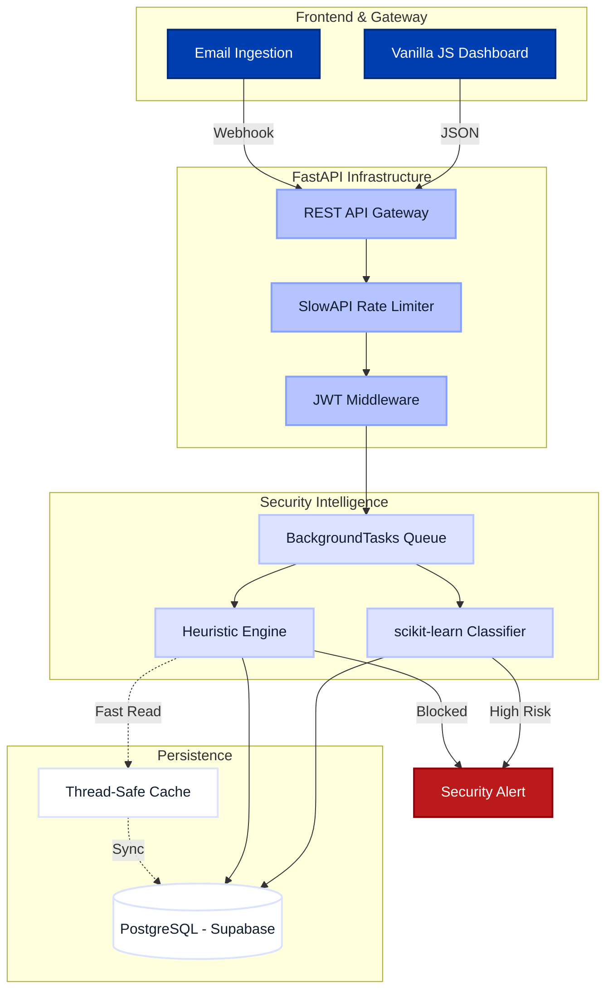
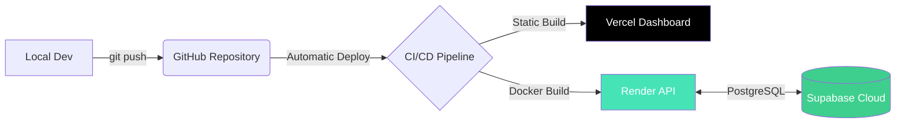

<p align="center">
  
</p>

# 🛡️ EmailGuard
### Hybrid AI-Powered Email Security & Threat Intelligence

<p align="center">
  
</p>

## 🚀 Live 
*   **Live Application**: [email-guard-ecru.vercel.app](https://email-guard-ecru.vercel.app/)
*   **Interactive API Docs**: [emailguard-17.onrender.com/docs](https://emailguard-17.onrender.com/docs)

---

## 🎯 The Problem
Email remains the #1 breach vector. Current solutions struggle with:
*   **Polymorphic Phishing:** Attackers slightly change wording to bypass static keyword filters.
*   **Analysis Latency:** Real-time scanning often slows down business communication.
*   **Data Silos:** Security results are hidden in logs rather than visualized for actionable intelligence.

## 💡 The Solution
EmailGuard provides a multi-layered defense that analyzes emails in **non-blocking background threads**, returning a risk assessment in milliseconds. It doesn't just block; it **classifies** intent (Wanted, Spam, Suspicious, Phishing) to give security teams granular control.

---

## 🏗️ System Architecture



### 🔍 Architecture Explanation
1.  **Request Flow:** API requests enter through a **Rate Limiter** (SlowAPI) to prevent DDoS. Valid requests are authenticated via **JWT**.
2.  **Immediate Hand-off:** Upon ingestion, the API returns a `202 Accepted`. The analysis is moved to **FastAPI BackgroundTasks**, ensuring the client is never blocked.
3.  **The Consensus Loop:** The ML model (semantic) and Heuristic Engine (structural) analyze the email in parallel.
4.  **Data Persistence:** Results are committed to **Supabase (PostgreSQL)**, and the dashboard polls optimized views for real-time updates.

---

## 🔁 Life of an Email (The Pipeline)
1.  **User Ingests:** Payload sent to `/emails/ingest`.
2.  **API Validation:** Pydantic schemas enforce strict data types.
3.  **Async Processing:** System starts classification:
    *   **Vectorization:** TF-IDF converts text to numerical features.
    *   **Inference:** Multinomial Naive Bayes predicts category.
    *   **Rules:** Scans for high-risk domains and keywords using a **Thread-Safe TTL Cache**.
4.  **Scoring:** Consensus score generated.
5.  **Alerting:** High-risk (Score > 80) triggers an immediate entry in the **Security Alerts** table.

---

## 📂 Project Structure

```bash
EmailGuard/
├── backend/                # FastAPI Application Source
│   ├── middleware/         # Auth, CORS, and Security Middleware
│   ├── models/             # SQLAlchemy Database Models
│   ├── routers/            # API Endpoints (Ingest, Analytics, Auth)
│   ├── schemas/            # Pydantic Data Validation Models
│   ├── services/           # Business Logic & ML Classifier
│   ├── config.py           # Environment Configuration
│   ├── database.py         # Supabase/PostgreSQL Connection
│   ├── main.py             # App Entry Point
│   └── requirements.txt    # Python Dependencies
├── Dashboard_UI/           # Frontend Application (Vanilla JS + Tailwind)
│   ├── assets/             # Brand Assets & Logos
│   ├── Overview_Dashboard.html # Primary Analytics View
│   ├── Email_Database.html     # Historical Record Explorer
│   ├── Rules_Keywords.html     # Security Rule Management
│   ├── Model_Performance.html  # ML Precision & Accuracy Tracking
│   ├── Security_Alerts.html    # Incident Response Panel
│   ├── Login.html/Signup.html  # Authentication Flow
│   └── dashboard_core.js       # Central Dashboard Logic & API Client
├── supabase_schema.sql     # Database Table Definitions
├── render.yaml             # Render.com Deployment Blueprints
└── README.md               # You are here 📍
```

---

## 🧪 API Documentation

### 1. Authentication
`POST /api/v1/auth/login`
**Request:**
```json
{
  "username": "admin",
  "password": "secure_password"
}
```
**Response:**
```json
{
  "access_token": "eyJhbG...",
  "token_type": "bearer"
}
```

### 2. Email Ingestion
`POST /api/v1/emails/ingest` (Requires Bearer Token)
**Request:**
```json
{
  "sender_email": "urgent@bank-verify.com",
  "subject": "Action Required",
  "body_text": "Your account is locked. Click here...",
  "has_attachments": false
}
```
**Response:**
```json
{
  "status": "processing",
  "message_id": "8a2f-11ed",
  "classification_queued": true
}
```

### 3. Analytics
`GET /api/v1/analytics/overview`
**Response:**
```json
{
  "total_emails": 1250,
  "spam_detected": 432,
  "phishing_blocked": 89,
  "accuracy": 0.982
}
```

---

## 🔐 Authentication Flow
1.  **Login:** Frontend sends credentials; Backend verifies and signs a **JWT (HS256)**.
2.  **Storage:** Token is stored in `localStorage` (`eg_token`).
3.  **Authorization:** All subsequent API calls include the token in the `Authorization: Bearer <token>` header.
4.  **Middleware:** `auth_middleware.py` intercepts requests, decodes the token, and injects the `current_user` into the dependency injection graph.

---

## 📊 Features Explained

*   🚀 **Async Analysis Engine**: Uses non-blocking background threads so security checks never delay user operations.
*   🤖 **Hybrid Intelligence**: Combines ML intent analysis with structural heuristics for zero-day threat detection.
*   📈 **Live Performance Tracking**: Monitors F1-Score and False Positive rates in real-time, allowing analysts to "see" the model's health.
*   🛡️ **Dynamic Keyword Management**: Instantly add/remove security rules that take effect across the entire system without a restart.

---

## ⚡ Performance Design
*   **Database Optimizations:** Uses optimized PostgreSQL views for the dashboard, replacing expensive `COUNT(*)` scans with aggregated materialized-style queries.
*   **Caching Strategy:** Implements a `Thread-Safe TTL Cache` for security rules, reducing DB round-trips for the most frequently matched patterns.
*   **Minimal Payload:** API responses are compressed and structured for minimum mobile latency.

---

## 🛠️ Local Setup

### Backend (FastAPI)
1.  `cd backend`
2.  `python -m venv venv && source venv/bin/activate`
3.  `pip install -r requirements.txt`
4.  `cp .env.example .env` (Add your Supabase credentials)
5.  `python run.py`

### Frontend (Dashboard)
1.  `cd Dashboard_UI`
2.  `python -m http.server 3000`
3.  Open `http://localhost:3000/Login.html`

---

## ☁️ Deployment

### ☁️ Infrastructure Mapping

| Layer | Platform | Service Type | Status |
| :--- | :--- | :--- | :--- |
| **Frontend** |  | Static Edge Hosting | [](https://email-guard-ecru.vercel.app/) |
| **Backend API** |  | Managed Python Service | [](https://emailguard-17.onrender.com/docs) |
| **Database** |  | Managed PostgreSQL |  |



### Required Environment Variables
| Key | Purpose | Example |
|---|---|---|
| `DATABASE_URL` | Supabase PG connection | `postgresql://...` |
| `SECRET_KEY` | JWT signing secret | `your-long-secret` |
| `ALLOWED_ORIGINS` | CORS protection | `https://your-vercel-app.com` |

---

## 🧭 How To Use (User Flow)
1.  **Sign Up/Login:** Access the portal via the Auth gateway.
2.  **Analyze Email:** Click the **bolt icon** (Analyze Email) in the top bar.
3.  **Input Data:** Paste a suspicious email sender and body.
4.  **Monitor:** Watch the **Real-time Stats** in the Overview tab update as the background analysis completes.
5.  **Review Alerts:** Check the **Security Alerts** panel for high-risk incident logs.

---

## 🚧 Limitations & Constraints
*   **Single Node Caching:** Current TTL cache is local; requires **Redis** for multi-instance scaling.
*   **ML Model:** Uses Naive Bayes (Fast but basic). Not yet capable of deep Transformer-based (BERT) semantic analysis.
*   **Dataset:** Current training set is ~25k samples; performance may vary with complex polymorphic attacks.

---

## 🔮 Future Roadmap
*   [ ] **Redis Integration:** Move background tasks to a distributed Celery queue.
*   [ ] **BERT Classification:** Implement deep semantic analysis via HuggingFace transformers.
*   [ ] **WebSockets:** Push live alert notifications to the dashboard without polling.

---

## 📜 License
Distributed under the MIT License. See `LICENSE` for more information.

<p align="center">Built with ❤️ for High-Performance Email Security</p>
